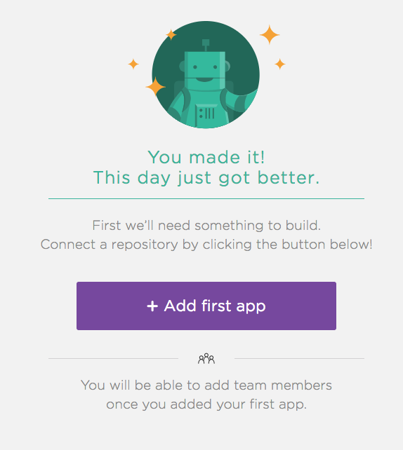
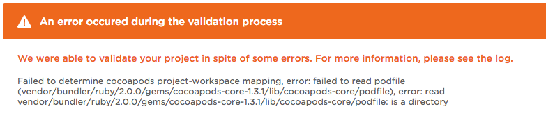
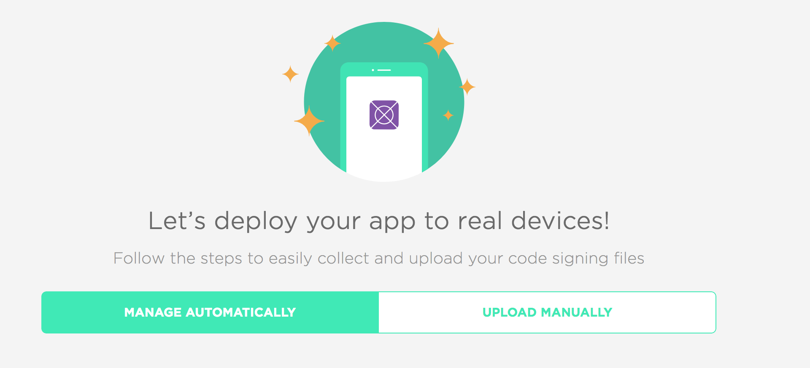

##　導入手順

公式url:https://www.bitrise.io/
個人だと制限あるけど、無料で使えます。



### CIをするアプリの登録

登録するAppを選択
↓
ローカルとも連携するかどうか聞かれる。
fastlaneなどと連携したい場合は、これも進める。

validationしようとしたら何やらひっかっかった。どうやらgithubでの公開鍵の設定がひっかかってる模様
と思ったけど、設定は結局問題なかった。

どうやらbitrise側で生成される鍵を使用しているgitサービスの鍵登録に追加する必要があるっぽい

登録してまたばりーでションやったら次は通ったには通ったけど、エラーがでてた。
見てみると、cocoapodっぽい。
Pofileはとくにいじってないので、一応pod updateしようとしたら怒られた。



なにやらわからんが、[コレ](https://stackoverflow.com/questions/38993527/cocoapods-failed-to-connect-to-github-to-update-the-cocoapods-specs-specs-repo)どおりにrbenvとかupdateした。

どうやら既存のrubyだとOpenSSLがサポートされたにバージョンがあって、脆弱性がなんとやらで、githubが2月にこれを禁止したらしい。
https://qiita.com/satoshi-iwaki/items/ed2c267127dcc80baa21


そんでビルドするとアプリが登録されて、kickするをやってみる。

<!-- そしたらまたエラー。。。わからん。。

まず１つ目はtestのところにFirebasemoduleがimportされてない、ってなる。いやそもそもテストしてないし。て思ったけど、うまい解決策見つからず、podfileのテストのところにfirebaseを追加。

次は何やら共有するスキームを追加しなければいけないので追加

その他にもいろいろとあるのだが時間がないためここで終了 -->

http://techblog.lclco.com/entry/2016/05/09/192230

>>　2018/03/31　追記：変更したらPUSHするのを忘れてました・・・


## iTunesConnectとの接続

ビルド表示画面にある↓のボタンをクリック


まだiTunesConnectの設定をしていなければ↓のような画面がでるはず！


""Manage Automatically""が選択されてる状態でガイドされてる通り、指定されたcurlコマンドをターミナルで打ち込みます。

こんな感じのことをきかれるので、使ってるprojectファイルをドラッグ＆ドロップ

```
Please drag-and-drop your Xcode Project (.xcodeproj) or Workspace (.xcworkspace) file, 
the one you usually open in Xcode, then hit Enter.

(Note: if you have a Workspace file you should most likely use that) : 
```

プロジェクトのアーカイブファイル作成待ち
```
  Running an Xcode Archive, to get all the required code signing settings..
```

作成完了したらこのチームでサインするか？とかきかれます

```
The archive used codesigning files of team: PNV979YSS5 - Shoichi Yamazaki
Would you like to use this team to sign your project? [YES/no]: Y

The Xcode archive used development certificate: iPhone Developer: Shoichi Yamazaki (KCM74RP9YC) [5278401348817272421].
Please select a distribution certificate:
Please select from the list:
[1] : iPhone Distribution: Shoichi Yamazaki (PNV979YSS5) [8446758960988674008]
(type in the option's number, then hit Enter) [1] : 1
```

↑のようにしたらp12ファイルができます。
これをbitriseのページにドラッグ＆ドロップ

パスワード設定を求められます。
適当なパスワードをいれましょう

次にiTunesコネクトに登録してあるアカウントいれてログインします。
いれたらパスコードを求められるので、とんできたパスコードを入力します。

成功したら、どのチームでアップロードするか聞かれるので、適切なチームを選んで、OK

`````

↓嵌って点についてにまとめました
https://qiita.com/zakiyamaaaaa/items/87fd2472e100936f06d0

